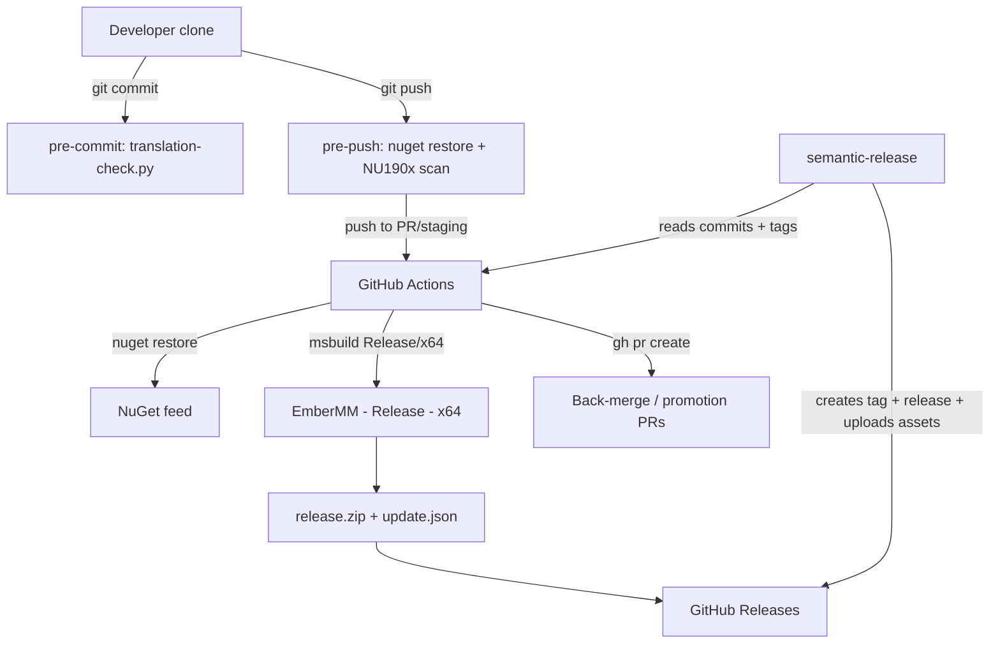

← [Back to overview](index.md)

# CI/CD & Git Hooks — Architecture

## Involved components

| Component | Type | Role |
|-----------|------|------|
| `.githooks/` (`install-hooks.*`, `pre-commit`, `pre-push`, `translation-check.py`) | Local Git hooks (sh/Python) | Client-side gates: `.resx` validation before commit, NU190x dependency scan before push |
| `.github/workflows/` (7 files) | GitHub Actions workflows | Server-side gates, pre-release/production-release chain, branch-flow automation, scheduled scan |
| `.github/actions/security-scan` | Composite action | Shared NuGet restore + NU190x evaluation + log artifact (single implementation used by three workflows) |
| `.github/actions/build-and-package` | Composite action | Shared `Release\|x64` build → `publish/` → `release.zip` + `update.json` (used by prerelease and release jobs) |
| `.nuget\NuGet.exe` | Repo-pinned tool (NuGet 6.14) | Package restore for the legacy `packages.config` model; doubles as the vulnerability scanner at restore time |
| `Directory.Build.props` + `Microsoft.NETFramework.ReferenceAssemblies.net48` | Build configuration | Lets MSBuild compile .NET Framework 4.8 without a Developer Pack on the runner |
| `package.json` / `package-lock.json` / `release.config.js` / `scripts/resolve-release-version.mjs` | semantic-release toolchain (Node 24) | Conventional-commits version resolution, tag/release creation, asset upload, run classification |
| GitHub Releases / GitHub API | External service | Hosts `vX.Y.Z` releases and `vX.Y.Z-rc.N` pre-releases with `release.zip` + `update.json` |
| Labels `automated-backmerge`, `automated-promotion` | GitHub labels | Mark the two automated PR types |

## Dependencies

- **GitHub Actions** — all server-side automation; `windows-latest` runners for MSBuild jobs, `ubuntu-latest` for git/CLI-only jobs.
- **NuGet.org / configured package sources** — restore and vulnerability audit feed.
- **semantic-release + plugins** (`commit-analyzer`, `release-notes-generator`, `@semantic-release/github`) — version determination and release publishing; synchronous calls within the jobs.
- **`gh` CLI** — label/PR/release management in the automation workflows.
- **Upstream neutrality:** everything under `.githooks/` and `.github/` is additive; the only intentional upstream deviations are `.gitattributes` (`eol=lf` for the hooks), the README section, and the `Newtonsoft.Json` 13.0.3 security update (fixes NU1903 / GHSA-5crp-9r3c-p9vr so the blocking gate starts green).

## Data flow

- Version numbers originate from the commit history (Conventional Commits) and existing `v*` tags — never from `AssemblyInfo`/`EMM_REVISION`, which keep their existing role.
- `update.json` carries `version`, `publishedAt` and per-asset `sha256`/`sizeBytes`/`assetUrl` derived from the produced `release.zip`.
- The staging RC number is derived from the count of existing `v<version>-rc.*` tags.

## Scaling and reliability

- Concurrency groups serialize or supersede runs: `pr-staging-<PR>` and `staging-ci` cancel in-progress runs; `release`, `sync-staging-with-main` and `staging-to-main-promotion` never cancel mid-run to avoid racing releases or lost automations.
- Timeouts bound each job (10–30 minutes); build/scan logs are uploaded as artifacts (`if: always()`, 14-day retention) for post-mortem analysis.
- The release workflow is idempotent for assets: an interrupted run is repaired via the `upload-existing` path instead of duplicating releases.
- `@semantic-release/github` runs with `successComment: false`/`failComment: false` because the token lacks comment permissions on PRs associated with released commits — a known failure mode absorbed from the reference implementation.
