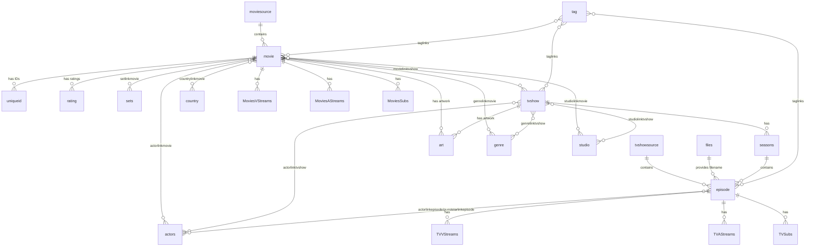

← [Back to overview](index.md)

# Database — Data Model

## Entities

### `movie`

Movie master record (title, original title, year, plot, `MoviePath`, IMDb ID, flags `New`/`Mark`/`Lock`, `idSource`, among others).

### `sets` + `setlinkmovie`

Movie sets (`sets`: name, overview) and the n:m mapping between movie and set.

### `tvshow`, `seasons`, `episode`

TV show hierarchy: `tvshow` (show master record), `seasons` (one season per show), `episode` (episode with season/episode numbers, `idShow` reference).

### `movielinktvshow`

n:m link between movies and TV shows (e.g. companion/bonus material).

### `files`, `moviesource`, `tvshowsource`

Filename registry (`files`: `idFile`, `strFilename` — referenced via `episode.idFile`; movies store their path directly in `movie.MoviePath`) and source directories — `moviesource` for movie sources, `tvshowsource` for TV show sources (each with path, language, ordering and exclusion options, last scan timestamp).

### `OrigPaths`, `EmberFiles`

Offline media (stubs): `OrigPaths` maps original paths to Ember paths per platform; `EmberFiles` holds the associated files including hash and `UseFile` flag.

### `ExcludeFiles`, `ExcludeDir`, `ExcludeFilesInFolders`

Scan exclusion rules: globally excluded filenames (`ExcludeFiles`), excluded directory names (`ExcludeDir`) and excluded files within specific folders (`ExcludeFilesInFolders`).

### `actors` + `actorlinkmovie`, `actorlinkepisode`, `actorlinktvshow`, `gueststarlinkepisode`

Persons and role links including guest stars per episode.

### `directorlinkmovie`, `directorlinkepisode`, `directorlinktvshow`, `writerlinkmovie`, `writerlinkepisode`, `creatorlinktvshow`

Crew links (directors, writers, creators).

### `genre`, `genrelinkmovie`, `genrelinktvshow`

Genres and their assignment.

### `country`, `countrylinkmovie`, `countrylinktvshow`

Production countries and their assignment.

### `studio`, `studiolinkmovie`, `studiolinktvshow`

Studios/networks and their assignment.

### `rating`

Ratings per media item and source (name, value, votes, default flag).

### `tag`, `taglinks`

User-defined tags and their assignment to media items.

### `art`

Artwork mapping: image type (poster, fanart, banner, landscape, clearart, clearlogo, discart, characterart, thumb) per media item with URL/file.

### `uniqueid`

External IDs per media item (IMDb, TMDb, TVDb and others) with default marker.

### `MoviesVStreams`, `MoviesAStreams`, `MoviesSubs`, `TVVStreams`, `TVAStreams`, `TVSubs`

Stream details from file analysis: video (codec, resolution, aspect ratio, duration), audio (codec, channels, language) and subtitle tracks (language, format) for movies and episodes respectively.

## Relationships

