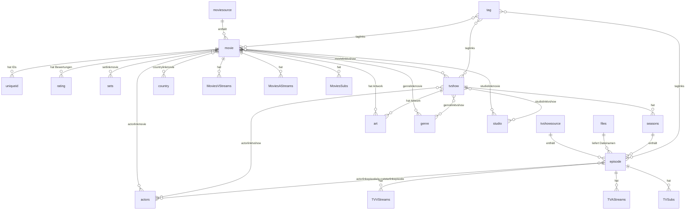

← [Zurück zur Übersicht](index.md)

# Datenbank — Datenmodell

## Entitäten

### `movie`

Film-Stammsatz (u. a. Titel, Originaltitel, Jahr, Handlung, `MoviePath`, IMDb-ID, Flags `New`/`Mark`/`Lock`, `idSource`).

### `sets` + `setlinkmovie`

Filmsammlungen (`sets`: Name, Übersicht) und n:m-Zuordnung Film↔Set.

### `tvshow`, `seasons`, `episode`

Serienhierarchie: `tvshow` (Serien-Stammsatz), `seasons` (Staffel je Serie), `episode` (Episode mit Staffel-/Episodennummer, `idShow`-Bezug).

### `movielinktvshow`

n:m-Verknüpfung Film↔Serie (z. B. Begleit-/Zusatzmaterial).

### `files`, `moviesource`, `tvshowsource`

Dateinamen-Registry (`files`: `idFile`, `strFilename` — referenziert über `episode.idFile`; Filme speichern ihren Pfad direkt in `movie.MoviePath`) und Quellverzeichnisse — `moviesource` für Filmquellen, `tvshowsource` für Serienquellen (jeweils mit Pfad, Sprache, Sortierungs- und Ausschlussoptionen, letztem Scan-Zeitpunkt).

### `OrigPaths`, `EmberFiles`

Offline-Medien (Stubs): `OrigPaths` bildet Originalpfade auf Ember-Pfade je Plattform ab; `EmberFiles` hält die zugehörigen Dateien inkl. Hash und `UseFile`-Flag.

### `ExcludeFiles`, `ExcludeDir`, `ExcludeFilesInFolders`

Scan-Ausschlussregeln: global ausgeschlossene Dateinamen (`ExcludeFiles`), ausgeschlossene Verzeichnisnamen (`ExcludeDir`) sowie ausgeschlossene Dateien innerhalb bestimmter Ordner (`ExcludeFilesInFolders`).

### `actors` + `actorlinkmovie`, `actorlinkepisode`, `actorlinktvshow`, `gueststarlinkepisode`

Personen und Rollenverknüpfungen inkl. Gaststars je Episode.

### `directorlinkmovie`, `directorlinkepisode`, `directorlinktvshow`, `writerlinkmovie`, `writerlinkepisode`, `creatorlinktvshow`

Crew-Verknüpfungen (Regie, Drehbuch, Creator).

### `genre`, `genrelinkmovie`, `genrelinktvshow`

Genres und Zuordnung.

### `country`, `countrylinkmovie`, `countrylinktvshow`

Produktionsländer und Zuordnung.

### `studio`, `studiolinkmovie`, `studiolinktvshow`

Studios/Netzwerke und Zuordnung.

### `rating`

Bewertungen je Medium und Quelle (Name, Wert, Stimmen, Default-Flag).

### `tag`, `taglinks`

Benutzerdefinierte Schlagworte und Zuordnung zu Medien.

### `art`

Artwork-Zuordnung: Bildtyp (poster, fanart, banner, landscape, clearart, clearlogo, discart, characterart, thumb) je Medium mit URL/Datei.

### `uniqueid`

Externe IDs je Medium (IMDb, TMDb, TVDb u. a.) mit Default-Markierung.

### `MoviesVStreams`, `MoviesAStreams`, `MoviesSubs`, `TVVStreams`, `TVAStreams`, `TVSubs`

Stream-Details aus der Dateianalyse: Video- (Codec, Auflösung, Seitenverhältnis, Dauer), Audio- (Codec, Kanäle, Sprache) und Untertitel-Spuren (Sprache, Format) für Filme bzw. Episoden.

## Beziehungen

