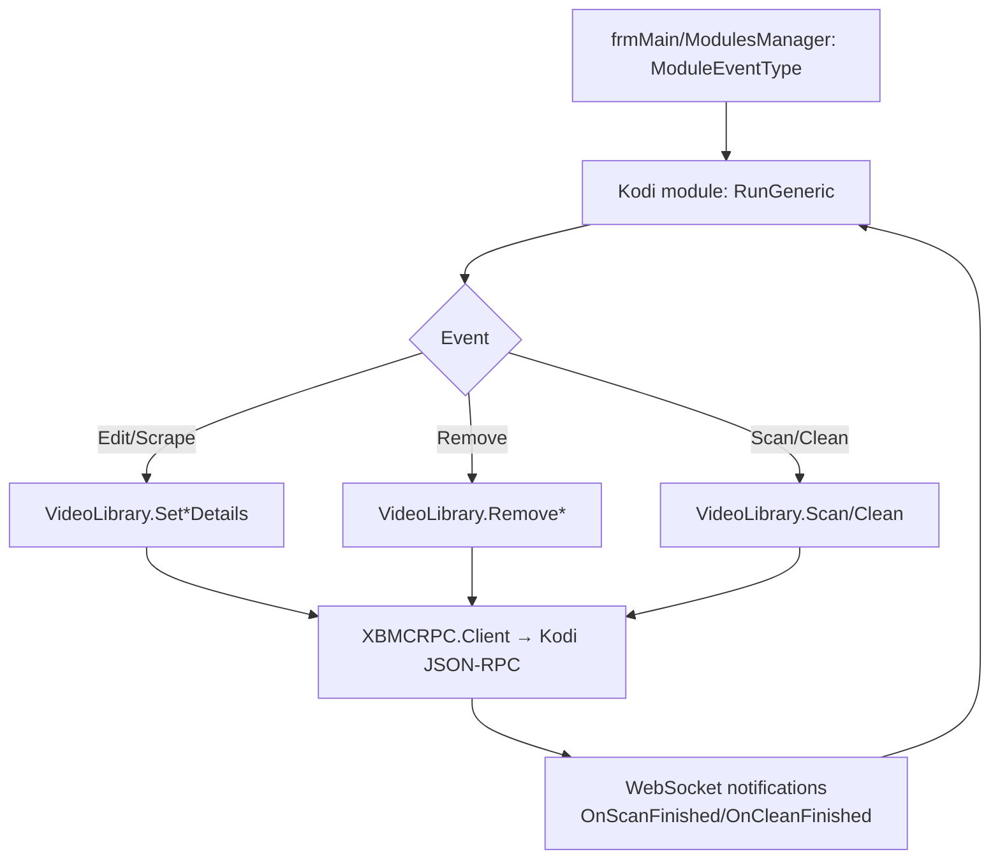

← [Back to overview](index.md)

# Kodi Interface — Technical Flow

## Overview

The module `generic.Interface.Kodi` implements `Interfaces.GenericModule` and subscribes to almost all `ModuleEventType` events (edit, scrape, remove). Internally `clsAPIKodi` (`Addons/generic.Interface.Kodi/clsAPIKodi.vb`) wraps the C# JSON-RPC client `XBMCRPC.Client` (`KodiAPI`). Each configured host is kept as `KodiInterface.Host`; `GetRemotePath` translates local paths into Kodi paths.

## Flow

### 1. Initialization

`Init` loads the host configuration; per host an `XBMCRPC.Client` with `ConnectionSettings` (host, port, credentials) and `ISocketFactory` (`GetSocket`) is created. A notification connection (`NotificationListenerSocketState`) keeps the WebSocket channel for Kodi events.

### 2. Event processing

`RunGeneric(mType, params, singleobjekt, dbelement)` receives events like `AfterEdit_Movie`, `AfterEdit_TVEpisode`, `ScraperSingle_*`, `ScraperMulti_*`, `Remove_Movie`, `Remove_TVEpisode`, `Remove_TVShow`, `BeforeEdit_*`, `Task`. Per event the affected `DBElement` data is translated into Kodi RPC calls:

- Edit/Scrape → `VideoLibrary.Set*Details` (Movie, MovieSet, TVShow, Season, Episode)
- Remove → `VideoLibrary.RemoveMovie`/`RemoveEpisode`/`RemoveTVShow`
- Library operations → `VideoLibrary.Scan`/`Clean`
- Artwork → `Textures.GetTextures`/`RemoveTexture`, `Files.PrepareDownload` + `GetImageStream`/`GetImageUri` for thumbnails
- Watched/queries → `VideoLibrary.GetMovies`/`GetMovieDetails`, `GetTVShows`/`GetTVShowDetails`, `GetSeasons`/`GetSeasonDetails`, `GetEpisodes`/`GetEpisodeDetails`, `GetMovieSets`/`GetMovieSetDetails`, `Files.GetSources`/`GetDirectory`, `Player.GetActivePlayers`

### 3. Path translation

`clsAPIKodi.GetRemotePath`/`GetRemotePath_MovieSet` maps local source paths onto Kodi sources (`Files.GetSources`) so Ember file paths can be resolved into Kodi `files`/`video` references.

### 4. Responses and notifications

- Kodi notifications `VideoLibrary.OnScanFinished`/`OnCleanFinished` are received via the socket listener and processed in `VideoLibrary_OnScanFinished`/`VideoLibrary_OnCleanFinished`.
- Errors (host unreachable, item unknown in Kodi, "Please Scrape In Ember First!") are reported via `GenericEvent`/`Notifications`.
- After successful synchronizations the module itself raises `GenericEvent(AfterEdit_*)` so downstream modules see the updated state.

## Diagram

## Error handling

- Unreachable hosts or RPC errors are caught and logged as error message/log — the Ember operation continues.
- Items without a known Kodi ID are skipped or a scan is recommended ("Please Scrape In Ember First!").
- `RunGeneric` is synchronous; a code comment notes an `Async` rework is planned for Ember 1.5.
