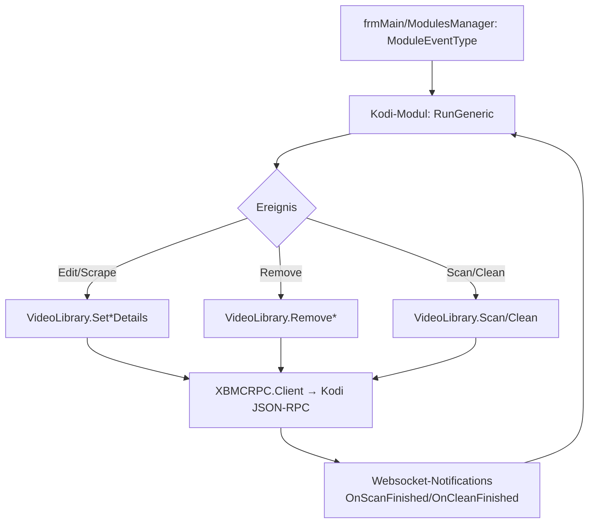

← [Zurück zur Übersicht](index.md)

# Kodi-Schnittstelle — Technischer Ablauf

## Übersicht

Das Modul `generic.Interface.Kodi` implementiert `Interfaces.GenericModule` und abonniert nahezu alle `ModuleEventType`-Ereignisse (Bearbeiten, Scrapen, Entfernen). Intern kapselt `clsAPIKodi` (`Addons/generic.Interface.Kodi/clsAPIKodi.vb`) den C#-JSON-RPC-Client `XBMCRPC.Client` (`KodiAPI`). Jeder konfigurierte Host wird als `KodiInterface.Host` geführt; `GetRemotePath` übersetzt lokale Pfade in Kodi-Pfade.

## Ablauf

### 1. Initialisierung

`Init` lädt die Host-Konfiguration; pro Host wird ein `XBMCRPC.Client` mit `ConnectionSettings` (Host, Port, Credentials) und `ISocketFactory` (`GetSocket`) erzeugt. Eine Notification-Verbindung (`NotificationListenerSocketState`) hält den WebSocket-Kanal für Kodi-Events.

### 2. Ereignis-Verarbeitung

`RunGeneric(mType, params, singleobjekt, dbelement)` empfängt Ereignisse wie `AfterEdit_Movie`, `AfterEdit_TVEpisode`, `ScraperSingle_*`, `ScraperMulti_*`, `Remove_Movie`, `Remove_TVEpisode`, `Remove_TVShow`, `BeforeEdit_*`, `Task`. Je Ereignis werden die betroffenen `DBElement`-Daten in Kodi-RPC-Aufrufe übersetzt:

- Edit/Scrape → `VideoLibrary.Set*Details` (Movie, MovieSet, TVShow, Season, Episode)
- Remove → `VideoLibrary.RemoveMovie`/`RemoveEpisode`/`RemoveTVShow`
- Bibliotheks-Operationen → `VideoLibrary.Scan`/`Clean`
- Artwork → `Textures.GetTextures`/`RemoveTexture`, `Files.PrepareDownload` + `GetImageStream`/`GetImageUri` für Thumbnails
- Watched/Abfragen → `VideoLibrary.GetMovies`/`GetMovieDetails`, `GetTVShows`/`GetTVShowDetails`, `GetSeasons`/`GetSeasonDetails`, `GetEpisodes`/`GetEpisodeDetails`, `GetMovieSets`/`GetMovieSetDetails`, `Files.GetSources`/`GetDirectory`, `Player.GetActivePlayers`

### 3. Pfad-Übersetzung

`clsAPIKodi.GetRemotePath`/`GetRemotePath_MovieSet` bildet lokale Quellpfade auf Kodi-Quellen ab (`Files.GetSources`), damit Ember-Dateipfade in Kodi-`files`-/`video`-Referenzen aufgelöst werden können.

### 4. Rückmeldungen und Benachrichtigungen

- Kodi-Notifications `VideoLibrary.OnScanFinished`/`OnCleanFinished` werden über den Socket-Listener empfangen und in `VideoLibrary_OnScanFinished`/`VideoLibrary_OnCleanFinished` verarbeitet.
- Fehler (Host nicht erreichbar, Element in Kodi unbekannt, „Please Scrape In Ember First!") werden über `GenericEvent`/`Notifications` gemeldet.
- Nach erfolgreichen Synchronisationen löst das Modul seinerseits `GenericEvent(AfterEdit_*)` aus, damit nachgelagerte Module den aktualisierten Stand sehen.

## Diagramm

## Fehlerbehandlung

- Nicht erreichbare Hosts oder RPC-Fehler werden abgefangen und als Fehlermeldung/Log protokolliert — der Ember-Vorgang läuft weiter.
- Elemente ohne bekannte Kodi-ID werden übersprungen bzw. es wird ein Scan empfohlen („Please Scrape In Ember First!").
- `RunGeneric` ist synchron; der Kommentar im Code vermerkt, dass ein `Async`-Umbau für Ember 1.5 vorgesehen ist.
