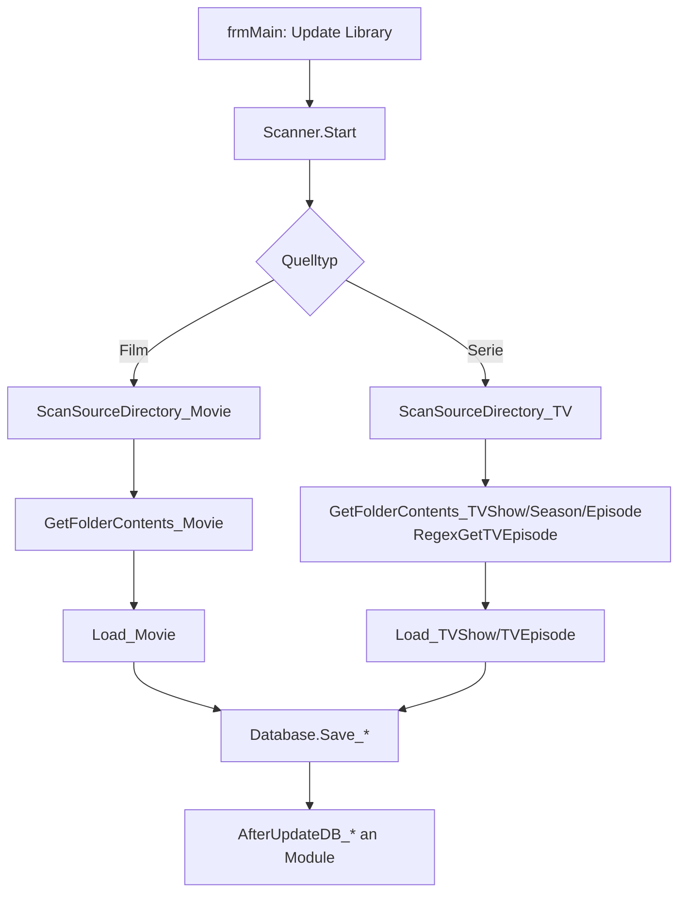

← [Zurück zur Übersicht](index.md)

# Medienbibliothek — Technischer Ablauf

## Übersicht

Der Scanlauf wird aus `frmMain` angestoßen und läuft im `Scanner` (`EmberAPI/clsAPIScanner.vb`) als Hintergrundprozess. Er durchläuft die konfigurierten `DBSource`-Quellen, erkennt Medien anhand von Ordner-/Dateistruktur, liest NFO- und Stream-Informationen und persistiert alles über `Database` (`clsAPIDatabase.vb`) in der SQLite-Datenbank. Abschließend werden `ModuleEventType.AfterUpdateDB_*`-Ereignisse an alle interessierten Module verteilt.

## Ablauf

### 1. Scanauftrag

`frmMain` ruft `Scanner.Start(Scan As Structures.ScanOrClean, SourceIDs, Folder)` auf — entweder für alle Quellen (*Update Library*, *Reload All*) oder für einzelne Quellen/Ordner.

Beteiligte Komponenten:
- `frmMain` — Menü-/Toolbar-Auslöser (`mnuMainToolsReloadMovies`, `mnuMainToolsReloadTVShows`, `mnuMainToolsReloadMovieSets`)
- `Scanner.Start` — Verteiler für Scan- bzw. Clean-Aufträge (`Structures.ScanOrClean`)

### 2. Verzeichnisse durchsuchen

Je Quelltyp:

- Filme: `Scanner.ScanSourceDirectory_Movie` → `ScanForFiles_Movie` → `ScanSubDirectory_Movie`/`SubDirsHaveMovies`/`IsValidDir`
- Serien: `Scanner.ScanSourceDirectory_TV` → `ScanForFiles_TV`; Episoden-Zuordnung über `Scanner.RegexGetTVEpisode` (Regex-Profile aus den Einstellungen)

`IsValidDir(dInfo, bIsTV)` wertet Ausschlussregeln aus (Auschlussverzeichnisse aus `Database.GetAll_ExcludedDirectories`, Advanced-Settings-Filter).

### 3. Medium laden

Je gefundenem Medium wird ein `Database.DBElement` befüllt:

- `Scanner.GetFolderContents_Movie/MovieSet/TVShow/TVSeason/TVEpisode` — ermittelt alle zum Medium gehörenden Dateien (Video, NFO, Bilder, Trailer, Untertitel)
- `Scanner.Load_Movie`/`Load_MovieSet`/`Load_TVShow`/`Load_TVEpisode` — liest vorhandene NFO via `NFO` (`clsAPINFO.vb`), extrahiert Stream-Informationen via `MediaInfo` (`clsAPIMediaInfo.vb`, MediaInfo.dll) bzw. `FFmpeg` (`clsAPIFFmpeg.vb`, ffprobe) und setzt Flags (`IsNew`, `IsMarked`, `IsLock`)

### 4. Persistieren

`Database.Save_*` schreibt das `DBElement` in die Tabellen `movie`/`tvshow`/`seasons`/`episode` samt Verknüpfungstabellen (Actors, Genres, Art, UniqueIds, Streams). `Database.Connect_MyVideos` öffnet dazu `MyVideos*.emm` (`SQLiteConnection`, `System.Data.SQLite`).

### 5. Nachbereitung und Events

- `Database.Clean`/`Delete_Invalid_TVEpisodes`/`Delete_Invalid_TVSeasons`/`Delete_Empty_TVSeasons` entfernen verwaiste Einträge (bei Clean-Aufträgen)
- `ModulesManager` verteilt `ModuleEventType.AfterUpdateDB_Movie`/`AfterUpdateDB_TV` an Module (z. B. Kodi-Sync, Bulk Renamer mit „Automatically Rename Files During Multi-Scraper")

## Diagramm

## Fehlerbehandlung

- Nicht lesbare/gesperrte Dateien werden protokolliert (`ErrorLog`, `dlgErrorViewer`) und der Scan läuft weiter.
- `Scanner.Cancel`/`CancelAndWait` brechen den laufenden Scan kontrolliert ab (*Canceling All Processes...*).
- Fehlende NFOs sind kein Fehler — das Medium wird mit Datei-/Ordnername + Stream-Daten angelegt und kann anschließend gescrapt werden.
