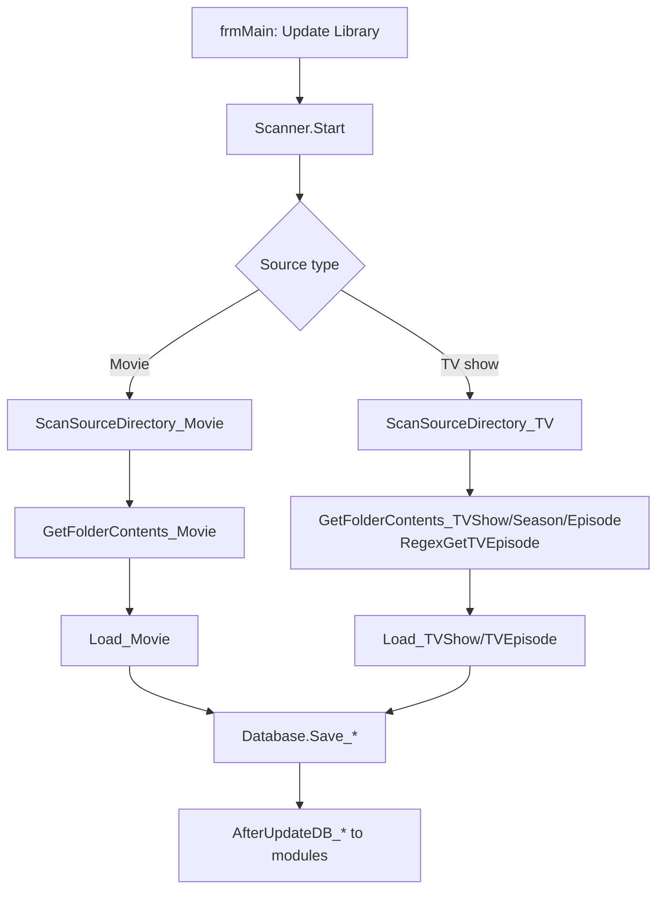

← [Back to overview](index.md)

# Media Library — Technical Flow

## Overview

The scan is triggered from `frmMain` and runs in the `Scanner` (`EmberAPI/clsAPIScanner.vb`) as a background process. It walks the configured `DBSource` sources, detects media from folder/file structure, reads NFO and stream information and persists everything via `Database` (`clsAPIDatabase.vb`) into the SQLite database. Finally `ModuleEventType.AfterUpdateDB_*` events are dispatched to all interested modules.

## Flow

### 1. Scan job

`frmMain` calls `Scanner.Start(Scan As Structures.ScanOrClean, SourceIDs, Folder)` — either for all sources (*Update Library*, *Reload All*) or for individual sources/folders.

Components involved:
- `frmMain` — menu/toolbar trigger (`mnuMainToolsReloadMovies`, `mnuMainToolsReloadTVShows`, `mnuMainToolsReloadMovieSets`)
- `Scanner.Start` — dispatcher for scan and clean jobs (`Structures.ScanOrClean`)

### 2. Scanning directories

Per source type:

- Movies: `Scanner.ScanSourceDirectory_Movie` → `ScanForFiles_Movie` → `ScanSubDirectory_Movie`/`SubDirsHaveMovies`/`IsValidDir`
- TV shows: `Scanner.ScanSourceDirectory_TV` → `ScanForFiles_TV`; episode assignment via `Scanner.RegexGetTVEpisode` (regex profiles from settings)

`IsValidDir(dInfo, bIsTV)` evaluates exclusion rules (excluded directories from `Database.GetAll_ExcludedDirectories`, advanced-settings filters).

### 3. Loading a media item

For each discovered item a `Database.DBElement` is populated:

- `Scanner.GetFolderContents_Movie/MovieSet/TVShow/TVSeason/TVEpisode` — collects all files belonging to the item (video, NFO, images, trailer, subtitles)
- `Scanner.Load_Movie`/`Load_MovieSet`/`Load_TVShow`/`Load_TVEpisode` — reads an existing NFO via `NFO` (`clsAPINFO.vb`), extracts stream information via `MediaInfo` (`clsAPIMediaInfo.vb`, MediaInfo.dll) or `FFmpeg` (`clsAPIFFmpeg.vb`, ffprobe) and sets flags (`IsNew`, `IsMarked`, `IsLock`)

### 4. Persisting

`Database.Save_*` writes the `DBElement` into the `movie`/`tvshow`/`seasons`/`episode` tables plus the link tables (actors, genres, art, uniqueIds, streams). `Database.Connect_MyVideos` opens `MyVideos*.emm` (`SQLiteConnection`, `System.Data.SQLite`).

### 5. Post-processing and events

- `Database.Clean`/`Delete_Invalid_TVEpisodes`/`Delete_Invalid_TVSeasons`/`Delete_Empty_TVSeasons` remove orphaned entries (on clean jobs)
- `ModulesManager` dispatches `ModuleEventType.AfterUpdateDB_Movie`/`AfterUpdateDB_TV` to modules (e.g. Kodi sync, Bulk Renamer with "Automatically Rename Files During Multi-Scraper")

## Diagram

## Error handling

- Unreadable/locked files are logged (`ErrorLog`, `dlgErrorViewer`) and the scan continues.
- `Scanner.Cancel`/`CancelAndWait` abort a running scan in a controlled way (*Canceling All Processes...*).
- Missing NFOs are not an error — the item is created from file/folder name plus stream data and can be scraped afterwards.
