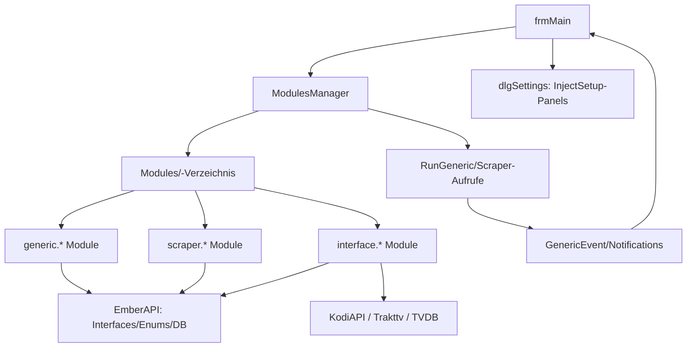

← [Zurück zur Übersicht](index.md)

# Modulsystem — Architektur

## Beteiligte Komponenten

| Komponente | Typ | Rolle |
|------------|-----|-------|
| `ModulesManager` (`clsAPIModules.vb`) | Singleton, EmberAPI | Lädt Module, hält Modullisten, verteilt Aufrufe |
| `Interfaces.GenericModule` | Interface | Basisvertrag aller Module |
| `Interfaces.ScraperModule_*` | Interfaces | Scraper-Verträge je Gruppe/Inhaltstyp |
| `Enums.ModuleEventType` | Enum | Ereigniskatalog (Edit/Update/Scrape/Remove/Sync/Task/Notification) |
| `Containers.SettingsPanel` | Typ | Modul-Einstellungspanel für `dlgSettings` |
| `Structures.ModuleResult` | Typ | Rückgabe der Modulaufrufe |
| `frmMain` / `dlgSettings` | UI | Auslöser von Ereignissen, Einbettung der Panels und Toolstrips |
| `Modules/` | Verzeichnis | Ablage der Addon-Assemblys |

## Abhängigkeiten

- Module hängen von `EmberAPI` ab (Interfaces, Enums, Containers, Settings) — `EmberAPI.dll` ist der Vertrags-Anchor.
- Interface-Module hängen zusätzlich von C#-Bibliotheken ab: Kodi → `KodiAPI` (`XBMCRPC`), Trakt → `Trakttv` + TraktApiSharp, TVDB-Scraper → vendored `TVDB`.
- Laufzeit-Abhängigkeit: `Modules`-Verzeichnis neben der Exe; `ModulesManager.moduleLocation = Path.Combine(Functions.AppPath, "Modules")`.

## Datenfluss

1. `frmMain` (Scan/Edit/Scrape/Menüaktion) erzeugt Ereignis.
2. `ModulesManager`/`frmMain` iterieren die interessierten Module (`ModuleType` enthält den `ModuleEventType`) und rufen `RunGeneric(mType, params, singleobjekt, dbelement)` bzw. die `Scraper`-Methode.
3. Module lesen/schreiben über `Database.DBElement`, `Master.DB`, `Master.eSettings`; UI-Rückmeldung über `GenericEvent`/`Notifications`.
4. Scraper liefern `SearchResultsContainer`/Bildlisten; `frmMain` übernimmt und persistiert.

## Diagramm

## Skalierung und Zuverlässigkeit

- Laden erfolgt im `bwLoadModules`-BackgroundWorker; einzelne defekte Module verhindern nicht den Start der übrigen.
- `SetupNeedsRestart`-Event erzwingt Neustart bei bestimmten Konfigurationsänderungen.
- `IsBusy` verhindert parallele konkurrierende Aufrufe desselben Moduls.
