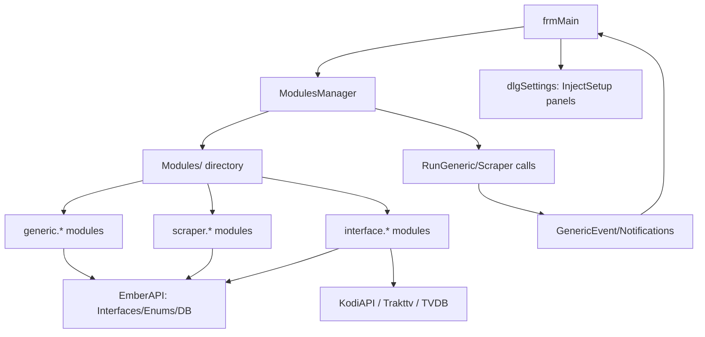

← [Back to overview](index.md)

# Module System — Architecture

## Components involved

| Component | Type | Role |
|-----------|------|------|
| `ModulesManager` (`clsAPIModules.vb`) | Singleton, EmberAPI | Loads modules, holds module lists, dispatches calls |
| `Interfaces.GenericModule` | Interface | Base contract of all modules |
| `Interfaces.ScraperModule_*` | Interfaces | Scraper contracts per group/content type |
| `Enums.ModuleEventType` | Enum | Event catalog (Edit/Update/Scrape/Remove/Sync/Task/Notification) |
| `Containers.SettingsPanel` | Type | Module settings panel for `dlgSettings` |
| `Structures.ModuleResult` | Type | Return value of module calls |
| `frmMain` / `dlgSettings` | UI | Event triggers, embedding of panels and toolstrips |
| `Modules/` | Directory | Location of the add-on assemblies |

## Dependencies

- Modules depend on `EmberAPI` (interfaces, enums, containers, settings) — `EmberAPI.dll` is the contract anchor.
- Interface modules additionally depend on C# libraries: Kodi → `KodiAPI` (`XBMCRPC`), Trakt → `Trakttv` + TraktApiSharp, TVDB scraper → vendored `TVDB`.
- Runtime dependency: `Modules` directory next to the exe; `ModulesManager.moduleLocation = Path.Combine(Functions.AppPath, "Modules")`.

## Data flow

1. `frmMain` (scan/edit/scrape/menu action) raises an event.
2. `ModulesManager`/`frmMain` iterate the interested modules (`ModuleType` contains the `ModuleEventType`) and call `RunGeneric(mType, params, singleobjekt, dbelement)` or the `Scraper` method.
3. Modules read/write via `Database.DBElement`, `Master.DB`, `Master.eSettings`; UI feedback via `GenericEvent`/`Notifications`.
4. Scrapers return `SearchResultsContainer`/image lists; `frmMain` adopts and persists them.

## Diagram

## Scaling and reliability

- Loading happens in the `bwLoadModules` BackgroundWorker; a single broken module does not prevent the others from starting.
- The `SetupNeedsRestart` event forces a restart on certain configuration changes.
- `IsBusy` prevents competing parallel calls into the same module.
