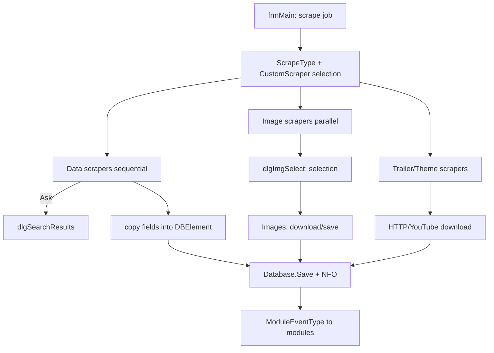

← [Back to overview](index.md)

# Scrapers — Technical Flow

## Overview

Scrapers are loadable modules that implement one of the nine scraper interfaces (`ScraperModule_{Data|Image|Theme|Trailer}_{Movie|MovieSet|TV}`) in addition to `Interfaces.GenericModule`. `ModulesManager` sorts loaded modules into separate lists per interface; `frmMain` drives the runs via `ScrapeType` and calls the modules in the configured order.

## Flow

### 1. Module loading

On startup `ModulesManager` (`clsAPIModules.vb`) loads all assemblies from the `Modules` directory and sorts them by implemented interface into `externalScrapersModules_Data_Movie`, `externalScrapersModules_Data_MovieSet`, `externalScrapersModules_Data_TV`, `externalScrapersModules_Image_*`, `externalScrapersModules_Theme_*`, `externalScrapersModules_Trailer_Movie`.

### 2. Scrape definition

`frmMain` determines scope and mode from `Enums.ScrapeType` (`AllAuto` … `FilterSkip`) and from the `dlgCustomScraper` dialog (fields, image types, language, options). The field/image selection corresponds to `ScraperEventType` (`NFOItem`, `PosterItem`, `FanartItem`, `TrailerItem`, `ThemeItem`, …).

### 3. Data scraping (sequential)

For each item `frmMain` calls the enabled data scrapers in *Scrape Order*:

1. The scraper searches candidates by title/year/IDs; in "Ask" mode the scraper opens its own `dlgSearchResults` dialog.
2. The scraper returns a `SearchResultsContainer`/container data.
3. `frmMain` copies only selected, unlocked and (depending on mode) empty fields into the `DBElement`.

Components involved:
- `Interfaces.ScraperModule_Data_*` — contract
- `*_Data.vb` of the scraper modules (`IMDB_Data`, `TMDB_Data`, `TVDB_Data`, `OMDb_Data`, `OFDB_Data`, `MoviepilotDE_Data`, `Trakttv_Data`)
- `NFO` — NFO writing; `Database.Save_*` — persistence

#### Title search in the IMDb data scraper (TMDb-based)

`scraper.Data.IMDB` (`clsScrapeIMDB.vb`) no longer parses IMDb HTML pages for the title search (the former `imdb.com/find` and `imdb.com/search/title` endpoints are unreachable in the expected form). `Scraper.SearchMovie`/`Scraper.SearchTVShow` query the TMDb API instead:

1. `GetClient()` lazily creates a `TMDbLib.Client.TMDbClient` with `_SpecialSettings.APIKey` (personal key or the embedded fallback `_strAPIKey`), awaits `GetConfigAsync()` and sets `MaxRetryCount = 2`.
2. `SearchMovieAsync(title, page, includeAdult := False, year)` resp. `SearchTvShowAsync(title, page)` iterate up to 3 result pages (`Page <= TotalPages AndAlso Page <= 3`); synchronous waits use `GetAwaiter().GetResult()` so the real exception (not an `AggregateException`) propagates.
3. Each hit's IMDb ID is resolved via `GetMovieExternalIdsAsync`/`GetTvShowExternalIdsAsync` → `ExternalIds*.ImdbId`. Hits without a resolvable IMDb ID are logged (`logger.Error`) and skipped; `UniqueIDs.TMDbId` is stored alongside.
4. Hits map to `MediaContainers.Movie` (`Title`, `Year`, `Lev` via `StringUtils.ComputeLevenshtein`) resp. `MediaContainers.TVShow` (`Title`, `Premiered`). Movie hits go to `SearchResults_Movie.ExactMatches` (title equal after `FilterYear` normalization and matching year) or `PartialMatches`; TV hits go to `SearchResults_TVShow.Matches`. `PopularTitles`/`TvTitles`/`VideoTitles`/`ShortTitles` remain part of the contract but stay empty.
5. The unchanged heuristics `GetSearchMovieInfo`/`GetSearchTVShowInfo` consume the lists per `ScrapeType`; both are wrapped in `Try/Catch` (`logger.Error` → `Nothing`). On a failed search in *Ask* mode they open the search dialog so the failure is visible and a manual IMDb ID can be entered.

#### Title-search error path (IMDb and TMDb scrapers)

- Worker failures in `bwIMDB_RunWorkerCompleted`/`bwTMDB_RunWorkerCompleted` are checked before `e.Result` (`e.Cancelled` → return; `e.Error` → unwrap `AggregateException`, `logger.Error`, `RaiseEvent Exception`). Previously the `e.Result` access re-threw and the result events never fired.
- The search dialogs (`dlgIMDBSearchResults_Movie`/`_TV`, `dlgTMDBSearchResults_Movie`/`_TV`/`_MovieSet`) subscribe `SearchFailed` to the `Exception` event and render an error node (*The search could not be completed: {0}*, eLang 1493) with a mapped reason — `UnauthorizedAccessException` → invalid/missing API key (1494), `RequestLimitExceededException` → request limit (1495), `HttpRequestException`/`WebException` → source unreachable (1496). `_searchPending` distinguishes a failed search from a failed detail lookup; in the latter case the selected node's ID is kept and the entry remains confirmable (eLang 1497).
- In `clsScrapeTMDB.vb`, `SearchMovie`/`SearchMovieSet`/`SearchTVShow` evaluate task results via `GetAwaiter().GetResult()` inside `Try/Catch` and rethrow; `GetSearchMovieInfo`/`GetSearchMovieSetInfo`/`GetSearchTVShowInfo` catch, log and return `Nothing` (in *Ask* mode with the dialog fallback described above).

### 4. Image/trailer/theme scraping (parallel)

- Image scrapers return image URLs with previews per `ScraperEventType`; `frmMain` merges the results in `dlgImgSelect`; `Images` (`clsAPIImages.vb`) downloads/saves the chosen images (MemoryStream-based).
- Trailer scrapers return URLs/qualities; download via `HTTP`/`YouTube` (`clsAPIYouTube.vb`, `VideoLibrary`) and stored as `-trailer` file; `FFmpeg` processes if needed.
- Theme scrapers return audio files as `theme`.

### 5. Completion

- `Database.Save_*` persists the item and `art` links
- `ModuleEventType` events (e.g. `AfterEdit_*`, scrape finished) go to generic modules (sync, rename and others)

## Diagram

## Error handling

- Failed scrapers or sources are logged (`ErrorLog`) and the run continues with the next scraper/item.
- *Cancel Scraper* aborts the running scrape operation (*Canceling Scraper...*).
- Invalid image/trailer URLs cause failed downloads, not abortion of the item.
