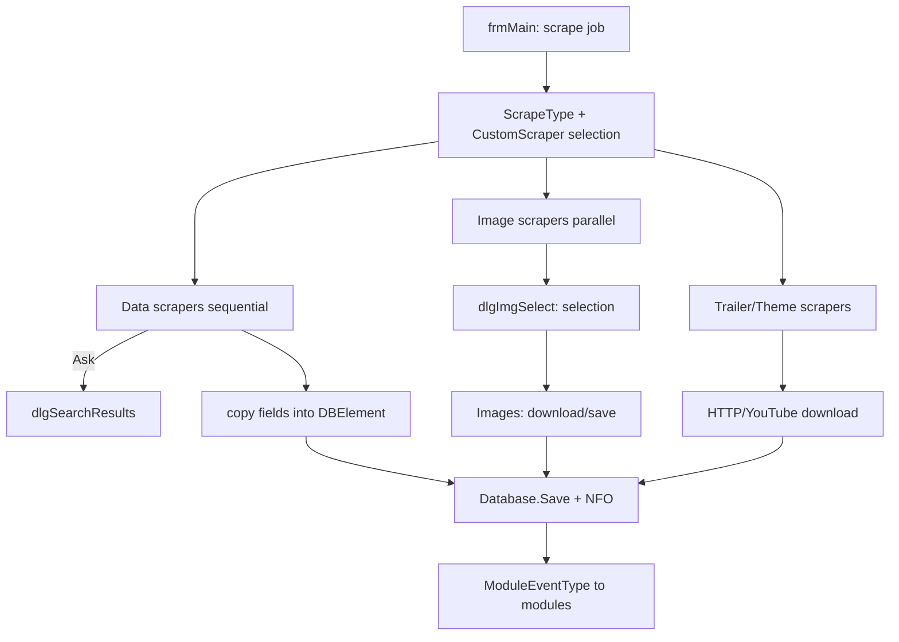

← [Back to overview](index.md)

# Scrapers — Technical Flow

## Overview

Scrapers are loadable modules that implement one of the nine scraper interfaces (`ScraperModule_{Data|Image|Theme|Trailer}_{Movie|MovieSet|TV}`) in addition to `Interfaces.GenericModule`. `ModulesManager` sorts loaded modules into separate lists per interface; `frmMain` drives the runs via `ScrapeType` and calls the modules in the configured order.

## Flow

### 1. Module loading

On startup `ModulesManager` (`clsAPIModules.vb`) loads all assemblies from the `Modules` directory and sorts them by implemented interface into `externalScrapersModules_Data_Movie`, `externalScrapersModules_Data_MovieSet`, `externalScrapersModules_Data_TV`, `externalScrapersModules_Image_*`, `externalScrapersModules_Theme_*`, `externalScrapersModules_Trailer_Movie`.

### 2. Scrape definition

`frmMain` determines scope and mode from `Enums.ScrapeType` (`AllAuto` … `FilterSkip`) and from the `dlgCustomScraper` dialog (fields, image types, language, options). The field/image selection corresponds to `ScraperEventType` (`NFOItem`, `PosterItem`, `FanartItem`, `TrailerItem`, `ThemeItem`, …).

### 3. Data scraping (sequential)

For each item `frmMain` calls the enabled data scrapers in *Scrape Order*:

1. The scraper searches candidates by title/year/IDs; in "Ask" mode the scraper opens its own `dlgSearchResults` dialog.
2. The scraper returns a `SearchResultsContainer`/container data.
3. `frmMain` copies only selected, unlocked and (depending on mode) empty fields into the `DBElement`.

Components involved:
- `Interfaces.ScraperModule_Data_*` — contract
- `*_Data.vb` of the scraper modules (`IMDB_Data`, `TMDB_Data`, `TVDB_Data`, `OMDb_Data`, `OFDB_Data`, `MoviepilotDE_Data`, `Trakttv_Data`)
- `NFO` — NFO writing; `Database.Save_*` — persistence

### 4. Image/trailer/theme scraping (parallel)

- Image scrapers return image URLs with previews per `ScraperEventType`; `frmMain` merges the results in `dlgImgSelect`; `Images` (`clsAPIImages.vb`) downloads/saves the chosen images (MemoryStream-based).
- Trailer scrapers return URLs/qualities; download via `HTTP`/`YouTube` (`clsAPIYouTube.vb`, `VideoLibrary`) and stored as `-trailer` file; `FFmpeg` processes if needed.
- Theme scrapers return audio files as `theme`.

### 5. Completion

- `Database.Save_*` persists the item and `art` links
- `ModuleEventType` events (e.g. `AfterEdit_*`, scrape finished) go to generic modules (sync, rename and others)

## Diagram

## Error handling

- Failed scrapers or sources are logged (`ErrorLog`) and the run continues with the next scraper/item.
- *Cancel Scraper* aborts the running scrape operation (*Canceling Scraper...*).
- Invalid image/trailer URLs cause failed downloads, not abortion of the item.
