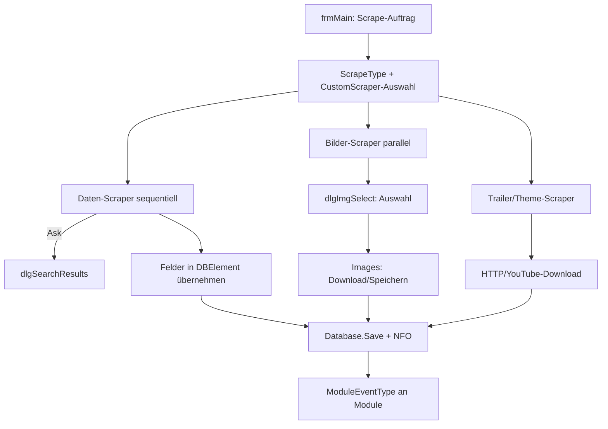

← [Zurück zur Übersicht](index.md)

# Scraper — Technischer Ablauf

## Übersicht

Scraper sind ladbare Module, die neben `Interfaces.GenericModule` eines der neun Scraper-Interfaces implementieren (`ScraperModule_{Data|Image|Theme|Trailer}_{Movie|MovieSet|TV}`). `ModulesManager` sortiert geladene Module in getrennte Listen je Interface; `frmMain` steuert die Läufe über `ScrapeType` und ruft die Module in der konfigurierten Reihenfolge auf.

## Ablauf

### 1. Modul-Ladung

Beim Start lädt `ModulesManager` (`clsAPIModules.vb`) alle Assemblys aus dem `Modules`-Verzeichnis und sortiert sie nach implementiertem Interface in `externalScrapersModules_Data_Movie`, `externalScrapersModules_Data_MovieSet`, `externalScrapersModules_Data_TV`, `externalScrapersModules_Image_*`, `externalScrapersModules_Theme_*`, `externalScrapersModules_Trailer_Movie`.

### 2. Scrape-Definition

`frmMain` ermittelt Umfang und Modus aus `Enums.ScrapeType` (`AllAuto` … `FilterSkip`) sowie aus dem `dlgCustomScraper`-Dialog (Felder, Bildtypen, Sprache, Optionen). Die Feld-/Bildauswahl entspricht `ScraperEventType` (`NFOItem`, `PosterItem`, `FanartItem`, `TrailerItem`, `ThemeItem`, …).

### 3. Daten-Scraping (sequentiell)

Für jedes Element ruft `frmMain` die aktivierten Daten-Scraper in *Scrape Order* auf:

1. Scraper sucht anhand Titel/Jahr/IDs Kandidaten; bei „Ask" öffnet der Scraper seinen eigenen `dlgSearchResults`-Dialog.
2. Der Scraper liefert `SearchResultsContainer`/Container-Daten zurück.
3. `frmMain` übernimmt nur ausgewählte, nicht gesperrte und (je Modus) leere Felder in das `DBElement`.

Beteiligte Komponenten:
- `Interfaces.ScraperModule_Data_*` — Vertrag
- `*_Data.vb` der Scraper-Module (`IMDB_Data`, `TMDB_Data`, `TVDB_Data`, `OMDb_Data`, `OFDB_Data`, `MoviepilotDE_Data`, `Trakttv_Data`)
- `NFO` — NFO-Schreiben; `Database.Save_*` — Persistenz

### 4. Bilder-/Trailer-/Theme-Scraping (parallel)

- Bild-Scraper liefern je `ScraperEventType` Bild-URLs mit Vorschau; `frmMain` führt die Ergebnisse in `dlgImgSelect` zusammen; `Images` (`clsAPIImages.vb`) lädt/speichert die gewählten Bilder (MemoryStream-basiert).
- Trailer-Scraper liefern URLs/Qualitäten; Download über `HTTP`/`YouTube` (`clsAPIYouTube.vb`, `VideoLibrary`) und Ablage als `-trailer`-Datei; `FFmpeg` verarbeitet bei Bedarf.
- Theme-Scraper liefern Audiodateien als `theme`.

### 5. Abschluss

- `Database.Save_*` persistiert Element und `art`-Verknüpfungen
- `ModuleEventType`-Events (z. B. `AfterEdit_*`, Scrape-Ende) gehen an generische Module (Sync, Rename u. a.)

## Diagramm

## Fehlerbehandlung

- Fehlgeschlagene Scraper oder Quellen werden protokolliert (`ErrorLog`) und der Lauf läuft mit dem nächsten Scraper/Element weiter.
- *Cancel Scraper* bricht den laufenden Scrape-Vorgang ab (`Canceling Scraper...`).
- Ungültige Bild-/Trailer-URLs führen zu fehlgeschlagenen Downloads, nicht zum Abbruch des Elements.
