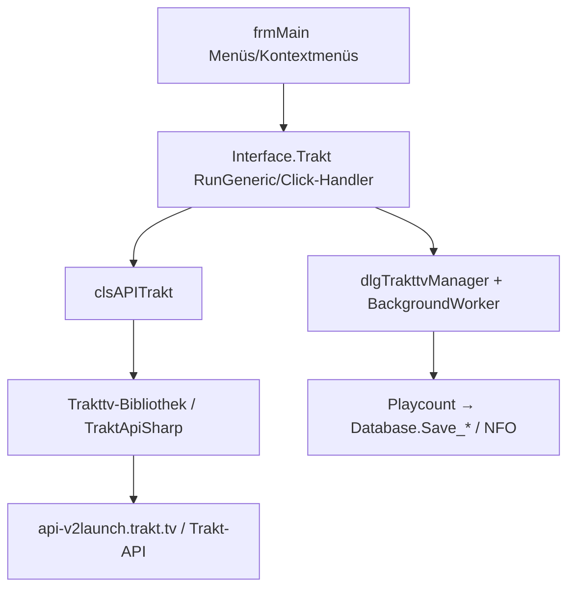

← [Zurück zur Übersicht](index.md)

# Trakt.tv — Technischer Ablauf

## Übersicht

Zwei Module nutzen Trakt.tv: `generic.Interface.Trakttv` (Sync/UI) und `scraper.Data.Trakttv` (Metadaten-Scraper). Beide kapseln `clsAPITrakt`, die gegen die Trakt-API-v2 arbeitet — einerseits über die im Repository liegende `Trakttv`-Bibliothek (`TraktAPI`, `TraktMethods`, `TraktURIs`, `TraktAPI.Model`) und andererseits über TraktApiSharp-Typen (`TraktNet.Objects`, `TraktApiSharp.Enums`, `TraktAuthorization`).

## Ablauf

### 1. Autorisierung und Token

- `frmAuthorize` führt die PIN-/OAuth-Freigabe durch; `TraktAuthorization.CreateWith` erzeugt das Token.
- `Handle_NewToken` speichert das Token in den Moduleinstellungen; `Handle_ModuleSettingsChanged`/`Handle_ModuleEnabledChanged` reagieren auf Konfigurationsänderungen.

### 2. Sync-Manager (`dlgTrakttvManager`)

Der Manager-Dialog („Sync lists and playcount with your trakt.tv account") arbeitet mit `BackgroundWorker`-Läufen:

- `bwSaveWatchedStateToEmber_Movies`/`bwSaveWatchedStateToEmber_TVEpisodes` — schreibt Playcounts nach Ember
- `_myWatchedMovies` (`TraktMovieWatched`), `_myWatchedTVEpisodes` (`TraktEpisodeWatched`), `_myWatchedProgressTVShows` (`TraktShowWatchedProgress`), `_myWatchedRatedMovies` — geladene Trakt-Zustände
- `myWatchlistEpisodes` — Watchlist-Abbildung; Tag-Sammlung wird aus der Ember-DB geladen, während der Laufzeit aktualisiert und zurückgeschrieben

`dlgWorker` zeigt Fortschritte der Sync-Aufträge.

### 3. Kontextmenü-Abfragen

`PopulateMenus`/`CreateContextMenu`/`CreateToolsMenu` hängen je `Enums.ContentType` Einträge in die Menüs; Handler rufen `clsAPITrakt`:

- `cmnuGetWatchedState_Movie/TVEpisode/TVSeason/TVShow_Click` — Watched-Status einzelner Elemente holen
- `mnuGetPlaycount_Movies/TVEpisodes_Click` — Playcounts laden

### 4. API-Aufrufe (`clsAPITrakt` → `TrakttvAPI`)

Aus dem Modul genutzte Aufrufe (Auswahl): `AddMoviesToWatchedHistory`, `AddShowsToWatchedHistoryEx`, `AddMoviesToRatings`, `AddItemsToList`, `AddUserList`, `AddCommentForMovie`, `GetComments`, `GetRatedEpisodes`, `GetProgressShow`, `GetNetworkFriends`, `GetNetworkFollowing`. Zuordnung erfolgt über IDs (`TraktItem.Ids`, `TraktSearchIdType.ImDB/TmDB/TvDB`).

## Diagramm

## Fehlerbehandlung

- Fehlende IDs (kein IMDb/TMDb/TVDb) → Element kann nicht zugeordnet werden, wird übersprungen.
- Token-/Netzwerkfehler → Fehlermeldung im Fehlerprotokoll (`dlgErrorViewer`); Ember-Daten bleiben unverändert.
- `Exceptions/` der `Trakttv`-Bibliothek definieren eigene Fehlertypen für API-Fehler.
